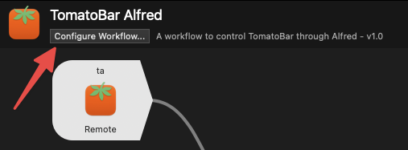
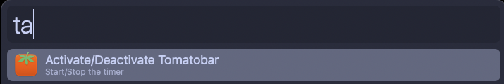

# tomatobar-alfred

 

Alfred 5 workflow for interacting with TomatoBar app for macOS 

## Install

### Manual install
1. Install [TomatoBar](https://github.com/ivoronin/TomatoBar)
2. Install the workflow from the [releases page](https://github.com/andreatitolo/tomatobar-alfred/releases/latest) (download the `.alfredworkflow` file and open it).

Note that the workflow requires Alfred [Powerpack](https://www.alfredapp.com/powerpack).

## Features

TomatoBar URI scheme currently only allows simple interactions with the app:
- **Activate the app**
- **Deactivate the app**
- **Customise Keyword**

If more options will be added, I'll make sure to update this workflow.

Customize the keyword to your liking by clicking on the `Configure Workflow` button under the workflow name in the workflow pane. Everything below this line is also included in the workflow readme.

## Usage
Control the TomatoBar app from Alfred. Toggle the timer on and off for the amount customised in the app settings (see the app [github repo](https://github.com/ivoronin/TomatoBar)).

The workflow has a pre-defined keyword (`ta`) but it can be customisable. If you have set it up, you can also use Alfred Remote to toggle the workflow on and off.

### Commands and Keywords

- `TomatoBar Activate/Deactivate` (default `ta`) - Activate TomatoBar for the default amount of time, defined in the app's settings.

### Variables

- `t_keyword` (default `ta`) - Main keyword to interact with the app.

### Support for Alfred Remote

If you have Alfred Remote installed and configured, you can add the workflow to its own page or add its commands to your page.

The process is (assuming you have [Alfred Remote](https://www.alfredapp.com/help/remote/) installed and [set-up](https://www.alfredapp.com/help/remote/setting-up/)):

1. Go to the `Remote` tab in `Alfred Preferences`
2. Click on `Add Remote Page` (the `+` button) at the bottom.
3. From the popup select `Workflows` → `TomatoBar Alfed` → `tomatobar-alfred-remote`
4. The workflow choice `TB Activate/Deactivate` should now show up in the remote page on your desktop and on your phone.
